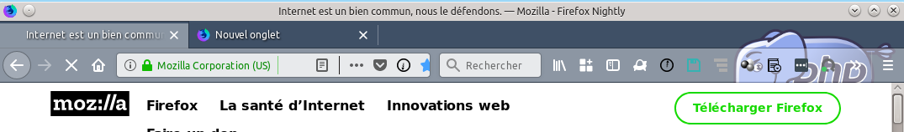

# Theme dynamic
## Introduction
Creating a dynamic theme for Firefox 58 and +

## What it does

The extension shows how to build a theme in a webExtension
It can be changed inside the code

## What it shows

The extension does:

We display an image with a transparent background
On top, an image shows a PHP elePHPant
it will be aligned at the top right of the header
The extension changes the colors "accentcolor" and "textcolor"

## API use : 

- [theme](https://developer.mozilla.org/en-US/Add-ons/WebExtensions/API/theme/)
- [windows.onCreated.addListener()](https://developer.mozilla.org/en-US/Add-ons/WebExtensions/API/windows/onCreated)
- [windows.getAll()](https://developer.mozilla.org/en-US/Add-ons/WebExtensions/API/windows/getAll)

- [manifest.json : theme](https://developer.mozilla.org/en-US/Add-ons/WebExtensions/manifest.json/theme)

## Crédit
(c) Christophe Villeneuve aka Hello / Sector One

Réalisé en 2018

